# Study Buddy - AI-Powered Study Companion

> 🏆 **Kiro Hackathon Submission** (January 5-30, 2026)

An AI-powered study companion for medical students that transforms study materials into actionable resources including question banks, mock tests, mnemonics, cheat sheets, and compiled notes.

## 🎯 Features

- **Multi-Format Upload**: PDF documents, images, scanned notes
- **Topic-Based Generation**: Enter any topic to generate study materials
- **5 Output Types**: Questions, Mock Tests, Mnemonics, Cheat Sheets, Notes
- **Session History**: All generated content saved and retrievable
- **Mobile OTP Authentication**: Secure user-based sessions

## 📊 System Architecture


## 🔄 Application Flow

```mermaid
flowchart TD
    Start([User Opens App]) --> Auth{Authenticated?}
    
    Auth -->|No| Login[Login/Register Page]
    Login --> OTP[Enter Mobile & OTP]
    OTP --> Dashboard[Study Buddy Dashboard]
    
    Auth -->|Yes| Dashboard
    
    Dashboard --> Choice{Input Method}
    
    Choice -->|Files| Upload[File Upload Interface]
    Choice -->|Text| TextInput[Text Input Form]
    
    Upload --> FileValidation{Valid Files?}
    FileValidation -->|No| UploadError[Show Error Message]
    UploadError --> Upload
    FileValidation -->|Yes| ProcessFiles[Process Files]
    
    TextInput --> ProcessText[Process Text Input]
    
    ProcessFiles --> Extract[Text Extraction]
    ProcessText --> Extract
    
    Extract --> AIProcess[AI Content Generation]
    
    AIProcess --> Generate[Generate 5 Content Types]
    
    Generate --> Questions[📝 Questions]
    Generate --> MockTests[🎯 Mock Tests]
    Generate --> Mnemonics[🧠 Mnemonics]
    Generate --> CheatSheets[📋 Cheat Sheets]
    Generate --> Notes[📚 Notes]
    
    Questions --> Results[Results Viewer]
    MockTests --> Results
    Mnemonics --> Results
    CheatSheets --> Results
    Notes --> Results
    
    Results --> Actions{User Action}
    Actions -->|Take Test| TestInterface[Mock Test Interface]
    Actions -->|Download| Export[Export Content]
    Actions -->|New Session| Dashboard
    Actions -->|View History| History[Session History]
    
    TestInterface --> TestResults[Test Results & Analytics]
    TestResults --> Results
    
    History --> SessionDetails[Session Details]
    SessionDetails --> Results
    
    Export --> Download[Download Files]
    Download --> Results
```



## 🏗️ Technical Architecture


## 🔐 Authentication Flow


## 📁 Processing Pipeline


## 🎨 User Interface Flow


## 🚀 Feature Overview


## 📊 Data Flow Architecture

```mermaid
graph TB
    subgraph "User Interface Layer"
        UI1[File Upload Component]
        UI2[Text Input Component]
        UI3[Results Viewer]
        UI4[Session Manager]
        UI5[Authentication Forms]
    end
    
    subgraph "API Gateway Layer"
        API1[/api/v1/auth/*]
        API2[/api/v1/upload/*]
        API3[/api/v1/text-input/*]
        API4[/api/v1/history/*]
    end
    
    subgraph "Business Logic Layer"
        BL1[Authentication Service]
        BL2[File Processing Service]
        BL3[AI Content Generator]
        BL4[Session Management]
        BL5[Progress Tracker]
    end
    
    subgraph "External Services"
        EXT1[Google Gemini API]
        EXT2[OTP Service]
        EXT3[OCR Engine]
    end
    
    subgraph "Data Storage"
        DB1[(Users Collection)]
        DB2[(Sessions Collection)]
        DB3[(Questions Collection)]
        DB4[(Mock Tests Collection)]
        DB5[(Mnemonics Collection)]
        DB6[(Cheat Sheets Collection)]
        DB7[(Notes Collection)]
        FS1[File Storage]
    end
    
    UI1 --> API2
    UI2 --> API3
    UI3 --> API4
    UI4 --> API4
    UI5 --> API1
    
    API1 --> BL1
    API2 --> BL2
    API3 --> BL2
    API4 --> BL4
    
    BL1 --> EXT2
    BL1 --> DB1
    BL2 --> EXT3
    BL2 --> BL3
    BL2 --> FS1
    BL3 --> EXT1
    BL3 --> DB3
    BL3 --> DB4
    BL3 --> DB5
    BL3 --> DB6
    BL3 --> DB7
    BL4 --> DB2
    BL5 --> DB2
```

## 🔄 Content Generation Workflow


## 💻 Tech Stack

| Component | Technology |
|-----------|------------|
| Frontend | Next.js 14, React, TypeScript, TailwindCSS |
| Backend | FastAPI, Python 3.12 |
| Database | MongoDB |
| AI | Google Gemini API |
| Auth | JWT + OTP via Email/SMS |

## 🔌 API Flow Diagram


## 🎯 Component Interaction Flow


## 🚀 Quick Start

### Prerequisites
- Python 3.12+
- Node.js 18+
- MongoDB running on `localhost:27017`

### Backend Setup
```bash
cd backend
python -m venv venv
source venv/bin/activate  # Windows: venv\Scripts\activate
pip install -r requirements.txt

# Configure environment
cp .env.example .env  # Edit with your API keys

# Run server
uvicorn app.main:app --reload --port 8000
```

### Frontend Setup
```bash
cd frontend
npm install
npm run dev
```

Open http://localhost:3000

## 📁 Project Structure

```
├── backend/
│   ├── app/
│   │   ├── api/           # API endpoints
│   │   ├── services/      # AI, processing, auth services
│   │   ├── config.py      # App configuration
│   │   └── main.py        # FastAPI app
│   └── requirements.txt
├── frontend/
│   └── src/
│       ├── app/           # Next.js pages
│       ├── components/    # React components
│       └── contexts/      # Auth context
└── .kiro/
    ├── steering/          # Project docs (product, tech, structure)
    ├── prompts/           # Custom Kiro commands
    └── documentation/     # Kiro CLI reference
```

## 🔗 API Endpoints

| Endpoint | Method | Description |
|----------|--------|-------------|
| `/api/v1/auth/register` | POST | Register with mobile + OTP |
| `/api/v1/auth/login` | POST | Login with mobile + password |
| `/api/v1/upload/` | POST | Upload files for processing |
| `/api/v1/text-input/` | POST | Generate from topic text |
| `/api/v1/history/sessions` | GET | Get user's session history |

## 🛠️ Kiro Development

This project was built using Kiro CLI. Key customizations:

- **Steering docs**: `.kiro/steering/` - Product, tech, and structure specs
- **Custom prompts**: `.kiro/prompts/` - 12 reusable prompts for development
- **Development workflow**: Agentic coding with Kiro's planning and execution modes

## 🎥 Demo

🎥 [Demo Video Link - Coming Soon]

## 👨‍💻 Author

Built for the Dynamous Kiro Hackathon 2026

## 📄 License

MIT
