<p align="center">
  
  
  
</p>

<h1 align="center">
  🎓 Study Buddy
  <br/>
  <sub>AI-Powered Study Companion for Medical Students</sub>
</h1>

<p align="center">
  <strong>Transform your study materials into actionable resources with the power of AI</strong>
</p>

<p align="center">
  <a href="https://study-material-generator.netlify.app/">
    
  </a>
</p>

---

## 🌐 Live Application

<table align="center">
  <tr>
    <td align="center">
      <h3>🔗 Live Website</h3>
      <a href="https://study-material-generator.netlify.app/">
        <strong>https://study-material-generator.netlify.app/</strong>
      </a>
    </td>
  </tr>
  <tr>
    <td align="center">
      <h3>🔐 Test Credentials</h3>
      <code>Mobile: 1234567890</code> | <code>Password: test_password</code>
    </td>
  </tr>
</table>

---

## 📚 Documentation

<table>
  <tr>
    <td align="center" width="25%">
      <a href="docs/FRONTEND_DOCUMENTATION.md">
        
      </a>
      <br/>
      <sub>Components, State, UI/UX</sub>
    </td>
    <td align="center" width="25%">
      <a href="docs/BACKEND_DOCUMENTATION.md">
        
      </a>
      <br/>
      <sub>Architecture, Services, DB</sub>
    </td>
    <td align="center" width="25%">
      <a href="docs/API_DOCUMENTATION.md">
        
      </a>
      <br/>
      <sub>Endpoints, Auth, Examples</sub>
    </td>
    <td align="center" width="25%">
      <a href="docs/TEST_DOCUMENTATION.md">
        
      </a>
      <br/>
      <sub>Testing Guide, CI/CD</sub>
    </td>
  </tr>
</table>

---

## 🏆 Kiro Hackathon Submission

> **January 5-30, 2026** | Built with ❤️ using Kiro CLI

Study Buddy is an **AI-powered study companion** specifically designed for medical students. It transforms study materials—whether PDFs, images, or topic text—into comprehensive, actionable resources including:

| 📝 Question Banks | 🎯 Mock Tests | 🧠 Mnemonics | 📋 Cheat Sheets | 📚 Notes | 🃏 Flashcards |
|:---:|:---:|:---:|:---:|:---:|:---:|
| 25+ MCQs per session | Timed tests with analytics | India-specific memory aids | High-yield summaries | Comprehensive notes | Spaced repetition |

---

## ✨ Key Features

<table>
<tr>
<td width="50%">

### 📤 Smart Input Processing
- **Multi-Format Upload**: PDF, Images (JPG/PNG), PPTX
- **Topic-Based Generation**: Enter any topic to generate materials
- **OCR Integration**: Extract text from scanned documents
- **Batch Processing**: Upload multiple files at once

</td>
<td width="50%">

### 🤖 AI-Powered Generation
- **Question Banks**: 25+ MCQs with detailed explanations
- **Mock Tests**: Timed assessments with auto-scoring
- **Mnemonics**: Culturally relevant memory aids
- **Cheat Sheets**: High-yield facts & quick references
- **Study Notes**: Comprehensive, organized summaries

</td>
</tr>
<tr>
<td width="50%">

### 🃏 Flashcard System
- **AI-Generated Cards**: Automatic flashcard creation
- **Spaced Repetition**: SM-2 algorithm for optimal retention
- **Difficulty Rating**: Easy/Medium/Hard classifications
- **Progress Tracking**: Visual analytics & review history

</td>
<td width="50%">

### 📅 Study Planner
- **AI Plan Generation**: Personalized study schedules
- **Daily Task Breakdown**: Structured daily goals
- **Progress Tracking**: Completion rates & streaks
- **Subject Distribution**: Balanced topic coverage

</td>
</tr>
<tr>
<td width="50%">

### 📥 Export System
- **PDF Generation**: Professional, styled documents
- **JSON Export**: Data portability & backups
- **Image Export**: Visual content for sharing
- **Batch Downloads**: Export all content at once

</td>
<td width="50%">

### 🔐 Security & Authentication
- **Mobile OTP**: Secure phone verification
- **JWT Tokens**: Session management
- **Rate Limiting**: API protection (100 req/min)
- **Input Validation**: Comprehensive security checks

</td>
</tr>
</table>

---

## 📊 System Architecture


---

## 🔄 Application Flow

```mermaid
flowchart TD
    Start([User Opens App]) --> Auth{Authenticated?}
    
    Auth -->|No| Login[Login/Register Page]
    Login --> OTP[Enter Mobile & OTP]
    OTP --> Dashboard[Study Buddy Dashboard]
    
    Auth -->|Yes| Dashboard
    
    Dashboard --> Choice{Input Method}
    
    Choice -->|Files| Upload[File Upload Interface]
    Choice -->|Text| TextInput[Text Input Form]
    
    Upload --> FileValidation{Valid Files?}
    FileValidation -->|No| UploadError[Show Error Message]
    UploadError --> Upload
    FileValidation -->|Yes| ProcessFiles[Process Files]
    
    TextInput --> ProcessText[Process Text Input]
    
    ProcessFiles --> Extract[Text Extraction]
    ProcessText --> Extract
    
    Extract --> AIProcess[AI Content Generation]
    
    AIProcess --> Generate[Generate 5 Content Types]
    
    Generate --> Questions[📝 Questions]
    Generate --> MockTests[🎯 Mock Tests]
    Generate --> Mnemonics[🧠 Mnemonics]
    Generate --> CheatSheets[📋 Cheat Sheets]
    Generate --> Notes[📚 Notes]
    Generate --> Flashcards[🃏 Flashcards]
    
    Questions --> Results[Results Viewer]
    MockTests --> Results
    Mnemonics --> Results
    CheatSheets --> Results
    Notes --> Results
    Flashcards --> FlashcardReview[Flashcard Review System]
    
    Results --> Actions{User Action}
    Actions -->|Take Test| TestInterface[Mock Test Interface]
    Actions -->|Study Plan| StudyPlanner[Study Planner]
    Actions -->|Download| Export[Export Content]
    Actions -->|New Session| Dashboard
    Actions -->|View History| History[Session History]
    
    FlashcardReview --> SpacedRepetition[Spaced Repetition Algorithm]
    SpacedRepetition --> Results
    
    StudyPlanner --> PlanGeneration[AI Plan Generation]
    PlanGeneration --> DailySchedule[Daily Study Schedule]
    DailySchedule --> ProgressTracking[Progress Tracking]
    ProgressTracking --> Results
    
    TestInterface --> TestResults[Test Results & Analytics]
    TestResults --> Results
    
    History --> SessionDetails[Session Details]
    SessionDetails --> Results
    
    Export --> Download[Download Files]
    Download --> Results
```



---

## 🏗️ Technical Architecture


---

## 🔐 Authentication Flow


---

## 📁 Processing Pipeline


---

## 🎨 User Interface Flow


---

## 🚀 Feature Overview


---

## 📊 Data Flow Architecture


---

## 🔄 Content Generation Workflow


---

## 🃏 Flashcard System Flow


---

## 📅 Study Planner Flow


---

## 📥 Export System Flow


---

## 💻 Tech Stack

<table align="center">
  <tr>
    <th>Layer</th>
    <th>Technology</th>
    <th>Purpose</th>
  </tr>
  <tr>
    <td><strong>Frontend</strong></td>
    <td>
      
      
      
      
    </td>
    <td>Modern, responsive UI with type safety</td>
  </tr>
  <tr>
    <td><strong>Backend</strong></td>
    <td>
      
      
      
    </td>
    <td>High-performance async API server</td>
  </tr>
  <tr>
    <td><strong>Database</strong></td>
    <td>
      
      
    </td>
    <td>Flexible document storage</td>
  </tr>
  <tr>
    <td><strong>AI</strong></td>
    <td>
      
    </td>
    <td>Advanced content generation</td>
  </tr>
  <tr>
    <td><strong>Auth</strong></td>
    <td>
      
      
    </td>
    <td>Secure authentication</td>
  </tr>
  <tr>
    <td><strong>Deployment</strong></td>
    <td>
      
      
    </td>
    <td>Scalable cloud hosting</td>
  </tr>
</table>

---

## 🔌 API Endpoints

| Endpoint | Method | Description |
|----------|--------|-------------|
| `/api/v1/auth/register` | POST | Register with mobile + OTP |
| `/api/v1/auth/login` | POST | Login with mobile + password |
| `/api/v1/upload/` | POST | Upload files for processing |
| `/api/v1/text-input/` | POST | Generate from topic text |
| `/api/v1/flashcards/{session_id}` | GET | Get session flashcards |
| `/api/v1/study-planner/generate-plan` | POST | Generate AI study plan |
| `/api/v1/download/{type}/{id}` | GET | Export/download content |
| `/api/v1/sessions` | GET | Get user's session history |

> 📖 **[Complete API Documentation](docs/API_DOCUMENTATION.md)** for detailed endpoints, request/response formats, and examples

---

## 🔌 API Flow Diagram


---

## 🎯 Component Interaction Flow


---

## 🚀 Quick Start

### Prerequisites

```bash
# Required software
- Python 3.12+
- Node.js 18+
- MongoDB running on localhost:27017
```

### Backend Setup

```bash
cd backend
python -m venv venv
source venv/bin/activate  # Windows: venv\Scripts\activate
pip install -r requirements.txt

# Configure environment
cp .env.example .env  # Edit with your API keys

# Run server
uvicorn app.main:app --reload --port 8000
```

### Frontend Setup

```bash
cd frontend
npm install
npm run dev
```

🌐 Open **http://localhost:3000**

---

## ⚙️ Configuration Options

### File Storage Configuration
```bash
# Local file storage (default)
FILE_STORAGE_TYPE=local
UPLOAD_DIR=./uploads

# AWS S3 storage
FILE_STORAGE_TYPE=s3
AWS_S3_BUCKET=your-bucket-name
AWS_ACCESS_KEY_ID=your-access-key
AWS_SECRET_ACCESS_KEY=your-secret-key
AWS_REGION=us-east-1
```

### Rate Limiting & Security
```bash
# Rate limiting (requests per minute per user)
RATE_LIMIT_PER_MINUTE=100

# File upload limits
MAX_FILE_SIZE=52428800  # 50MB in bytes
MAX_FILES_PER_UPLOAD=10
ALLOWED_FILE_TYPES=pdf,jpg,jpeg,png,pptx

# Security settings
JWT_EXPIRY_HOURS=24
OTP_EXPIRY_MINUTES=5
```

### Mock Test Features
- **Timed Tests**: Configurable duration (default: 60 minutes)
- **Auto-Scoring**: Immediate results with detailed analytics
- **Question Navigation**: Jump to any question, mark for review
- **Performance Analytics**: Score breakdown, time per question
- **Retry Capability**: Retake tests multiple times
- **Progress Tracking**: Track improvement over time

### Email Notification System
```bash
# Email service configuration
ENABLE_EMAIL_NOTIFICATIONS=true
SMTP_HOST=smtp.gmail.com
SMTP_PORT=587
SMTP_USERNAME=your-email@gmail.com
SMTP_PASSWORD=your-app-password
FROM_EMAIL=studybuddy@yourapp.com

# Notification settings
NOTIFY_ON_COMPLETION=true
NOTIFY_ON_ERROR=true
EMAIL_TEMPLATE_PATH=./templates/emails/
```

**Email Features:**
- **Processing Complete**: Notify when AI generation is finished
- **Error Alerts**: Notify if processing fails
- **Custom Templates**: Professional email templates
- **User Preference**: Users can opt-in/out of notifications
- **Session Links**: Direct links to view results

---

## 📁 Project Structure

```
├── backend/
│   ├── app/
│   │   ├── api/           # API endpoints
│   │   ├── services/      # AI, processing, auth services
│   │   ├── config.py      # App configuration
│   │   └── main.py        # FastAPI app
│   └── requirements.txt
├── frontend/
│   └── src/
│       ├── app/           # Next.js pages
│       ├── components/    # React components
│       └── contexts/      # Auth context
├── docs/
│   ├── API_DOCUMENTATION.md       # API reference
│   ├── BACKEND_DOCUMENTATION.md   # Backend architecture
│   ├── FRONTEND_DOCUMENTATION.md  # Frontend guide
│   └── TEST_DOCUMENTATION.md      # Testing guide
└── .kiro/
    ├── steering/          # Project docs (product, tech, structure)
    ├── prompts/           # Custom Kiro commands
    └── documentation/     # Kiro CLI reference
```

---

## 🛠️ Kiro Development

This project was built using **Kiro CLI**. Key customizations:

- **Steering docs**: `.kiro/steering/` - Product, tech, and structure specs
- **Custom prompts**: `.kiro/prompts/` - 12 reusable prompts for development
- **Development workflow**: Agentic coding with Kiro's planning and execution modes

---

## 📈 Performance & Scalability

| Metric | Value |
|--------|-------|
| **Processing Time** | 2-5 minutes per session |
| **Concurrent Users** | Tested up to 100 |
| **API Response Time** | < 200ms (avg) |
| **File Upload Limit** | 50MB per file, 200MB total |
| **Rate Limit** | 100 requests/minute/user |

---

## 🎥 Demo

Coming soon! Stay tuned for video walkthrough.

---

## 👨‍💻 Author

<p align="center">
  <strong>Deepak Yadav</strong>
  <br/>
  Built with ❤️ for the <strong>Dynamous Kiro Hackathon 2026</strong>
</p>

---

## 📄 License

<p align="center">
  
</p>

---

<p align="center">
  <sub>© 2026 Study Buddy | AI-Powered Study Companion</sub>
</p>
