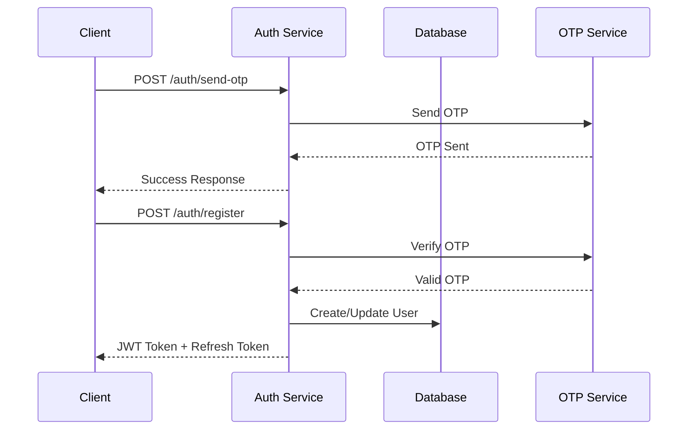
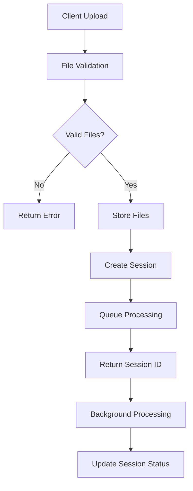
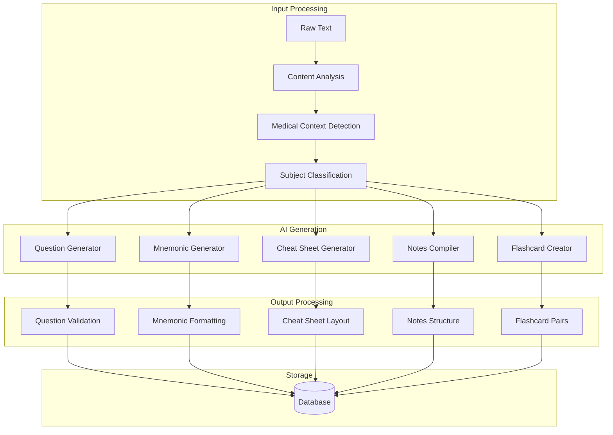

# Study Buddy App - API Architecture Documentation

## 🏗️ RESTful API Design

Complete API architecture documentation for Study Buddy App backend services.

---

## 📋 API Overview

### Base Configuration
```
Base URL: https://your-domain.com/api/v1
Protocol: HTTPS
Authentication: Bearer JWT Token
Content-Type: application/json
Rate Limit: 100 requests/minute per user
```

### API Versioning
- **Current Version**: v1
- **Version Header**: `API-Version: v1`
- **Backward Compatibility**: Maintained for 1 year
- **Deprecation Notice**: 6 months advance notice

---

## 🔐 Authentication Architecture

### JWT Token Flow


### Token Structure
```json
{
  "access_token": "eyJ0eXAiOiJKV1QiLCJhbGciOiJIUzI1NiJ9...",
  "refresh_token": "eyJ0eXAiOiJKV1QiLCJhbGciOiJIUzI1NiJ9...",
  "token_type": "bearer",
  "expires_in": 86400,
  "user_id": "507f1f77bcf86cd799439011"
}
```

---

## 📤 File Upload Architecture

### Upload Flow


### File Processing Pipeline
```python
# Processing stages
1. File Upload & Validation
2. Text Extraction (PDF/OCR/AI)
3. Content Analysis
4. AI Content Generation
5. Database Storage
6. Status Update
```

---

## 🧠 AI Service Architecture

### Content Generation Flow


### AI Service Configuration
```python
AI_CONFIG = {
    "model": "gemini-1.5-pro",
    "temperature": 0.7,
    "max_tokens": 8192,
    "timeout": 300,
    "retry_attempts": 3,
    "medical_context": True,
    "india_specific": True
}
```

---

## 📊 Database Architecture

### Connection Management
```python
# MongoDB connection with connection pooling
class DatabaseManager:
    def __init__(self):
        self.client = AsyncIOMotorClient(
            MONGODB_URL,
            maxPoolSize=50,
            minPoolSize=5,
            maxIdleTimeMS=30000,
            serverSelectionTimeoutMS=5000
        )
        self.db = self.client[DATABASE_NAME]
```

### Repository Pattern
```python
# Base repository for common operations
class BaseRepository:
    def __init__(self, collection_name: str):
        self.collection = db[collection_name]
    
    async def create(self, data: dict) -> str:
        result = await self.collection.insert_one(data)
        return str(result.inserted_id)
    
    async def find_by_id(self, id: str) -> dict:
        return await self.collection.find_one({"_id": ObjectId(id)})
    
    async def find_by_user(self, user_id: str) -> List[dict]:
        cursor = self.collection.find({"user_id": ObjectId(user_id)})
        return await cursor.to_list(length=None)
```

---

## 🔄 API Endpoints Architecture

### Endpoint Categories

#### 1. Authentication Endpoints
```
POST   /api/v1/auth/send-otp      # Send OTP to mobile
POST   /api/v1/auth/register      # Register/Login with OTP
POST   /api/v1/auth/refresh       # Refresh JWT token
POST   /api/v1/auth/logout        # Logout user
GET    /api/v1/auth/profile       # Get user profile
PUT    /api/v1/auth/profile       # Update user profile
```

#### 2. File Management Endpoints
```
POST   /api/v1/upload             # Upload files for processing
GET    /api/v1/upload/status/{id} # Get upload status
DELETE /api/v1/upload/{id}        # Delete uploaded files
GET    /api/v1/files/{session_id} # List session files
```

#### 3. Processing Endpoints
```
GET    /api/v1/process/{session_id}        # Get processing status
POST   /api/v1/process/{session_id}/retry  # Retry failed processing
DELETE /api/v1/process/{session_id}        # Cancel processing
```

#### 4. Content Retrieval Endpoints
```
GET    /api/v1/sessions                    # List user sessions
GET    /api/v1/sessions/{session_id}       # Get session details
DELETE /api/v1/sessions/{session_id}       # Delete session

GET    /api/v1/questions/{session_id}      # Get generated questions
GET    /api/v1/mock-tests/{session_id}     # Get mock tests
GET    /api/v1/mnemonics/{session_id}      # Get mnemonics
GET    /api/v1/cheat-sheets/{session_id}   # Get cheat sheets
GET    /api/v1/notes/{session_id}          # Get compiled notes
GET    /api/v1/flashcards/{session_id}     # Get flashcards
```

#### 5. Interactive Features
```
POST   /api/v1/mock-tests/{test_id}/start     # Start mock test
POST   /api/v1/mock-tests/{test_id}/submit    # Submit test answers
GET    /api/v1/mock-tests/{test_id}/results   # Get test results

GET    /api/v1/flashcards/due                # Get due flashcards
POST   /api/v1/flashcards/{card_id}/review   # Submit flashcard review
GET    /api/v1/flashcards/stats               # Get review statistics
```

#### 6. Study Planning
```
POST   /api/v1/study-plans                   # Create study plan
GET    /api/v1/study-plans                   # List user study plans
GET    /api/v1/study-plans/{plan_id}         # Get plan details
PUT    /api/v1/study-plans/{plan_id}         # Update plan
DELETE /api/v1/study-plans/{plan_id}         # Delete plan

POST   /api/v1/study-plans/{plan_id}/tasks/{task_id}/complete  # Mark task complete
GET    /api/v1/study-plans/{plan_id}/progress                  # Get progress
```

#### 7. Export & Download
```
GET    /api/v1/export/questions/{session_id}     # Export questions as PDF
GET    /api/v1/export/cheat-sheets/{session_id}  # Export cheat sheets
GET    /api/v1/export/notes/{session_id}         # Export notes
GET    /api/v1/export/flashcards/{session_id}    # Export flashcards
GET    /api/v1/export/session/{session_id}       # Export entire session
```

#### 8. System Endpoints
```
GET    /api/v1/health                # Health check
GET    /api/v1/health/db             # Database health
GET    /api/v1/health/ai             # AI service health
GET    /api/v1/metrics               # System metrics (admin only)
```

---

## 📝 Request/Response Patterns

### Standard Response Format
```json
{
  "success": true,
  "data": {
    // Response data here
  },
  "message": "Operation completed successfully",
  "timestamp": "2026-01-26T08:44:26.022Z",
  "request_id": "req_123456789"
}
```

### Error Response Format
```json
{
  "success": false,
  "error": {
    "code": "VALIDATION_ERROR",
    "message": "Invalid file format",
    "details": {
      "field": "file_type",
      "allowed_types": ["pdf", "jpg", "png", "pptx"]
    }
  },
  "timestamp": "2026-01-26T08:44:26.022Z",
  "request_id": "req_123456789"
}
```

### Pagination Response
```json
{
  "success": true,
  "data": {
    "items": [...],
    "pagination": {
      "page": 1,
      "per_page": 20,
      "total": 150,
      "pages": 8,
      "has_next": true,
      "has_prev": false
    }
  }
}
```

---

## 🔒 Security Architecture

### Authentication Middleware
```python
async def authenticate_user(request: Request):
    token = request.headers.get("Authorization")
    if not token or not token.startswith("Bearer "):
        raise HTTPException(401, "Missing or invalid token")
    
    try:
        payload = jwt.decode(token[7:], JWT_SECRET, algorithms=[JWT_ALGORITHM])
        user_id = payload.get("user_id")
        if not user_id:
            raise HTTPException(401, "Invalid token payload")
        return user_id
    except JWTError:
        raise HTTPException(401, "Token validation failed")
```

### Rate Limiting
```python
# Rate limiting by user ID
RATE_LIMITS = {
    "default": "100/minute",
    "upload": "10/minute", 
    "auth": "5/minute",
    "ai_processing": "20/hour"
}

@limiter.limit("100/minute")
async def protected_endpoint(request: Request):
    # Endpoint logic here
    pass
```

### Input Validation
```python
# Pydantic models for request validation
class UploadRequest(BaseModel):
    files: List[UploadFile]
    processing_mode: Literal["default", "ocr", "ai-based"] = "default"
    session_name: Optional[str] = None
    
    @validator('files')
    def validate_files(cls, v):
        if len(v) > MAX_FILES_PER_UPLOAD:
            raise ValueError(f"Maximum {MAX_FILES_PER_UPLOAD} files allowed")
        return v
```

---

## 📈 Performance Architecture

### Caching Strategy
```python
# Redis caching for frequently accessed data
@cache(expire=3600)  # 1 hour cache
async def get_user_sessions(user_id: str):
    return await session_repository.find_by_user(user_id)

# Cache AI responses to avoid regeneration
@cache(expire=86400)  # 24 hour cache
async def generate_questions(content_hash: str, count: int):
    return await ai_service.generate_questions(content, count)
```

### Async Processing
```python
# Background task processing
@celery_app.task
async def process_uploaded_files(session_id: str):
    session = await get_session(session_id)
    
    # Process files in parallel
    tasks = []
    for file_info in session.files_uploaded:
        task = asyncio.create_task(process_single_file(file_info))
        tasks.append(task)
    
    results = await asyncio.gather(*tasks)
    
    # Generate content using AI
    await generate_all_content(session_id, results)
```

### Database Optimization
```python
# Efficient queries with proper indexing
class SessionRepository:
    async def find_user_sessions_paginated(self, user_id: str, page: int, per_page: int):
        skip = (page - 1) * per_page
        cursor = self.collection.find(
            {"user_id": ObjectId(user_id)},
            {"files_uploaded": 0}  # Exclude large fields
        ).sort("created_at", -1).skip(skip).limit(per_page)
        
        return await cursor.to_list(length=per_page)
```

---

## 🔄 API Versioning Strategy

### Version Management
```python
# Version-specific routers
app.include_router(v1_router, prefix="/api/v1")
app.include_router(v2_router, prefix="/api/v2")  # Future version

# Version detection middleware
@app.middleware("http")
async def version_middleware(request: Request, call_next):
    version = request.headers.get("API-Version", "v1")
    request.state.api_version = version
    response = await call_next(request)
    response.headers["API-Version"] = version
    return response
```

### Backward Compatibility
```python
# Maintain compatibility for deprecated fields
class SessionResponseV1(BaseModel):
    session_id: str
    session_name: str
    created_at: datetime
    # Deprecated field maintained for v1
    status: str = Field(alias="processing_status")

class SessionResponseV2(BaseModel):
    session_id: str
    session_name: str
    created_at: datetime
    processing_status: str  # New field name
    progress_percentage: int  # New field
```

---

## 📊 Monitoring & Observability

### Health Checks
```python
@router.get("/health")
async def health_check():
    checks = {
        "database": await check_database_health(),
        "ai_service": await check_ai_service_health(),
        "file_storage": await check_file_storage_health()
    }
    
    overall_status = "healthy" if all(checks.values()) else "unhealthy"
    
    return {
        "status": overall_status,
        "checks": checks,
        "timestamp": datetime.utcnow(),
        "version": "1.0.0"
    }
```

### Metrics Collection
```python
# Prometheus metrics
from prometheus_client import Counter, Histogram, Gauge

REQUEST_COUNT = Counter('api_requests_total', 'Total API requests', ['method', 'endpoint'])
REQUEST_DURATION = Histogram('api_request_duration_seconds', 'Request duration')
ACTIVE_SESSIONS = Gauge('active_processing_sessions', 'Currently processing sessions')

@app.middleware("http")
async def metrics_middleware(request: Request, call_next):
    start_time = time.time()
    
    response = await call_next(request)
    
    REQUEST_COUNT.labels(
        method=request.method,
        endpoint=request.url.path
    ).inc()
    
    REQUEST_DURATION.observe(time.time() - start_time)
    
    return response
```

### Logging Architecture
```python
# Structured logging
import structlog

logger = structlog.get_logger()

@router.post("/upload")
async def upload_files(request: UploadRequest, user_id: str = Depends(authenticate_user)):
    logger.info(
        "File upload started",
        user_id=user_id,
        file_count=len(request.files),
        processing_mode=request.processing_mode
    )
    
    try:
        session_id = await process_upload(request, user_id)
        
        logger.info(
            "File upload completed",
            user_id=user_id,
            session_id=session_id
        )
        
        return {"session_id": session_id}
        
    except Exception as e:
        logger.error(
            "File upload failed",
            user_id=user_id,
            error=str(e),
            exc_info=True
        )
        raise
```

---

*API Architecture Documentation - Study Buddy App v1.0.0*
