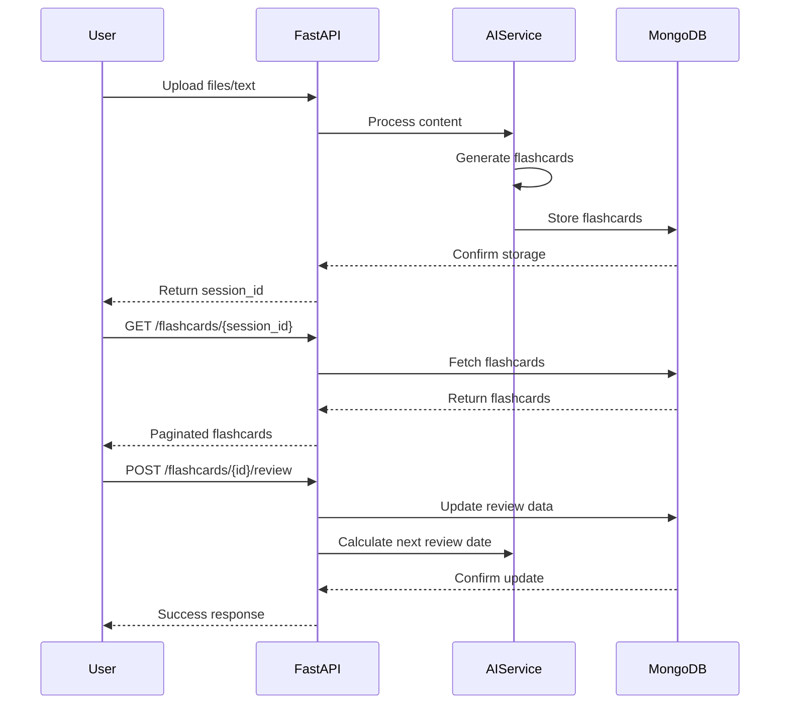
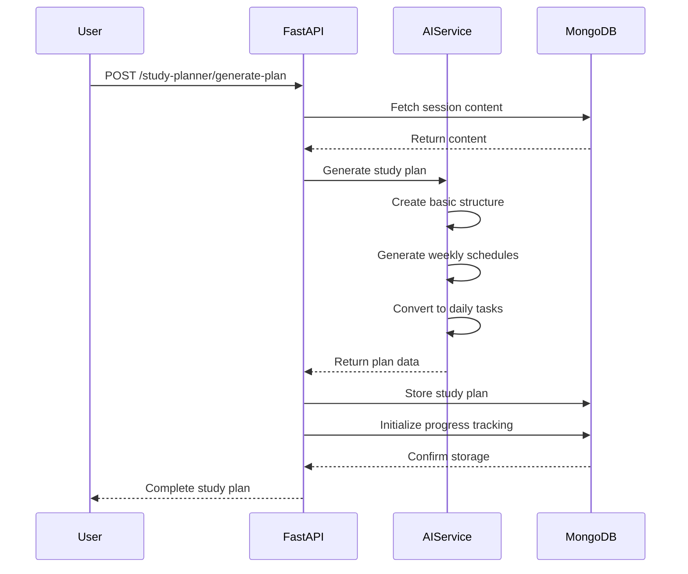
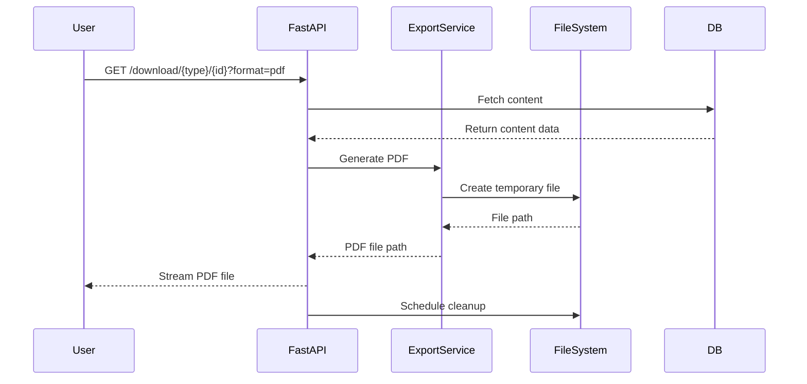

# StudyBuddy Backend Documentation

## Architecture Overview

The StudyBuddy backend is built using FastAPI with a microservices architecture, featuring three core new functionalities:

1. **Flashcard Generator** - AI-powered flashcards with spaced repetition
2. **Study Planner** - Personalized study schedules with progress tracking  
3. **Export System** - Multi-format content export (PDF, JSON, images)

## Project Structure

```
backend/
├── app/
│   ├── main.py                    # FastAPI application entry point
│   ├── config.py                  # Configuration settings
│   ├── database.py                # MongoDB connection
│   │
│   ├── models/                    # Data models
│   │   ├── core.py               # Core models (Session, Question, etc.)
│   │   └── study_plan.py         # Study planner models
│   │
│   ├── services/                  # Business logic
│   │   ├── ai_service.py         # AI content generation
│   │   ├── processing.py         # File processing pipeline
│   │   ├── export_service.py     # Export functionality
│   │   ├── file_processor.py     # File handling
│   │   └── auth_service.py       # Authentication
│   │
│   ├── api/                      # API endpoints
│   │   ├── v1/endpoints/         # Version 1 endpoints
│   │   │   ├── flashcards.py     # Flashcard management
│   │   │   ├── study_planner.py  # Study planning
│   │   │   ├── download.py       # Export/download
│   │   │   ├── upload.py         # File upload
│   │   │   ├── questions.py      # Question retrieval
│   │   │   └── sessions.py       # Session management
│   │   └── auth_simple.py        # Authentication endpoints
│   │
│   └── utils/                    # Utilities
│       ├── error_handler.py      # Error handling
│       └── db_helpers.py         # Database utilities
```

## Core Features Implementation

### 1. Flashcard Generator

#### Service Layer (`services/ai_service.py`)
```python
class AIService:
    async def generate_flashcards(self, text: str, num_cards: int = 20) -> List[Dict[str, Any]]:
        """Generate flashcards from text content using AI"""
        # AI prompt engineering for flashcard generation
        # Spaced repetition algorithm integration
        # Quality validation and filtering
```

#### API Layer (`api/v1/endpoints/flashcards.py`)
```python
@router.get("/{session_id}")
async def get_session_flashcards(session_id: str, skip: int = 0, limit: int = 50):
    """Retrieve flashcards for a session with pagination"""

@router.post("/{flashcard_id}/review")
async def review_flashcard(flashcard_id: str, review: FlashcardReview):
    """Record flashcard review and update spaced repetition schedule"""
```

#### Data Models (`models/core.py`)
```python
class Flashcard(BaseModel):
    id: str
    session_id: str
    question: str
    answer: str
    difficulty: str
    subject: str
    tags: List[str]
    next_review_date: Optional[datetime]
    review_count: int = 0
    success_rate: float = 0.0
```

### 2. Study Planner

#### Service Layer (`services/ai_service.py`)
```python
class AIService:
    async def generate_study_plan(self, session_content: Dict, config: Dict) -> Dict:
        """Generate personalized study plan using AI"""
        # Analyze available content
        # Generate basic plan structure
        # Create weekly schedules
        # Convert to daily tasks with proper validation
```

#### API Layer (`api/v1/endpoints/study_planner.py`)
```python
@router.post("/generate-plan")
async def generate_study_plan(request: StudyPlanRequest):
    """Generate AI-powered study plan"""

@router.get("/plans")
async def get_user_study_plans():
    """Get all study plans for authenticated user"""

@router.put("/tasks/{task_id}/status")
async def update_task_status(task_id: str, request: TaskUpdateRequest):
    """Update task completion status and recalculate progress"""
```

#### Data Models (`models/study_plan.py`)
```python
class StudyPlan(BaseModel):
    plan_id: str
    session_id: str
    user_id: str
    plan_name: str
    config: StudyPlanConfig
    daily_schedules: List[DailySchedule]
    total_study_days: int
    total_study_hours: int
    subjects_covered: List[str]
    created_at: datetime

class DailySchedule(BaseModel):
    date: date
    total_study_time: int
    tasks: List[StudyTask]
    total_tasks: int

class StudyTask(BaseModel):
    task_id: str
    title: str
    description: str
    task_type: StudyTaskType
    subject: MedicalSubject
    estimated_duration: int
    priority: int
    content_ids: List[str]
    status: StudyTaskStatus = StudyTaskStatus.PENDING
```

### 3. Export System

#### Service Layer (`services/export_service.py`)
```python
class ExportService:
    def generate_questions_pdf(self, questions: List[Question]) -> str:
        """Generate PDF export for questions"""
        
    def generate_flashcards_pdf(self, flashcards: List[Flashcard]) -> str:
        """Generate PDF export for flashcards"""
        
    def generate_study_plan_pdf(self, study_plan: StudyPlan) -> str:
        """Generate PDF export for study plan"""
```

#### API Layer (`api/v1/endpoints/download.py`)
```python
@router.get("/{content_type}/{content_id}")
async def download_content(content_type: str, content_id: str, format: str = "pdf"):
    """Download content in specified format"""
    # Support for PDF, JSON, and image formats
    # Temporary file management with automatic cleanup
```

## Database Schema

### MongoDB Collections

#### 1. flashcards
```javascript
{
  _id: ObjectId,
  id: String,
  session_id: String,
  user_id: ObjectId,
  question: String,
  answer: String,
  difficulty: String, // "easy" | "medium" | "hard"
  subject: String,
  tags: [String],
  next_review_date: ISODate,
  review_count: Number,
  success_rate: Number,
  created_at: ISODate,
  updated_at: ISODate
}
```

#### 2. study_plans
```javascript
{
  _id: String, // Same as plan_id
  plan_id: String,
  session_id: String,
  user_id: String,
  plan_name: String,
  config: {
    exam_date: ISODate,
    daily_study_hours: Number,
    weak_areas: [String]
  },
  daily_schedules: [{
    date: ISODate,
    total_study_time: Number,
    tasks: [{
      task_id: String,
      title: String,
      description: String,
      task_type: String,
      subject: String,
      estimated_duration: Number,
      priority: Number,
      content_ids: [String],
      status: String
    }],
    total_tasks: Number
  }],
  total_study_days: Number,
  total_study_hours: Number,
  subjects_covered: [String],
  created_at: ISODate
}
```

#### 3. study_progress
```javascript
{
  _id: String, // plan_id + "_progress"
  plan_id: String,
  user_id: String,
  total_tasks: Number,
  completed_tasks: Number,
  progress_percentage: Number,
  current_streak: Number,
  last_activity: ISODate,
  daily_progress: [{
    date: ISODate,
    tasks_completed: Number,
    study_time: Number
  }],
  created_at: ISODate,
  updated_at: ISODate
}
```

## API Flow Diagrams

### Flashcard Generation Flow


### Study Plan Generation Flow


### Export System Flow


## Configuration

### Environment Variables
```bash
# Database
MONGODB_URL=mongodb://localhost:27017/studybuddy
DATABASE_NAME=studybuddy

# AI Service
GOOGLE_AI_API_KEY=your-gemini-api-key
GEMINI_API_KEY=your-gemini-api-key  # Fallback

# Authentication
JWT_SECRET=your-jwt-secret
JWT_ALGORITHM=HS256
JWT_EXPIRY=86400

# File Storage
UPLOAD_DIR=./uploads
MAX_FILE_SIZE=52428800  # 50MB
TEMP_DIR=./temp

# Export Settings
PDF_FONT_PATH=./fonts/
EXPORT_CLEANUP_HOURS=24

# Rate Limiting
RATE_LIMIT_PER_MINUTE=100
UPLOAD_RATE_LIMIT=5
```

### Dependencies
```txt
fastapi==0.104.1
uvicorn==0.24.0
pymongo==4.6.0
motor==3.3.2
pydantic==2.5.0
python-jose[cryptography]==3.3.0
python-multipart==0.0.6
google-generativeai==0.3.2
reportlab==4.0.7
Pillow==10.1.0
PyPDF2==3.0.1
python-pptx==0.6.23
```

## Error Handling

### Custom Exception Classes
```python
class StudyBuddyException(Exception):
    """Base exception for StudyBuddy application"""
    
class FlashcardGenerationError(StudyBuddyException):
    """Raised when flashcard generation fails"""
    
class StudyPlanGenerationError(StudyBuddyException):
    """Raised when study plan generation fails"""
    
class ExportError(StudyBuddyException):
    """Raised when export operations fail"""
```

### Error Response Format
```json
{
  "detail": "Error message",
  "error_code": "ERROR_CODE",
  "timestamp": "2026-01-23T15:30:00Z",
  "request_id": "uuid"
}
```

## Testing

### Test Structure
```
tests/
├── unit/
│   ├── test_flashcard_service.py
│   ├── test_study_planner.py
│   └── test_export_service.py
├── integration/
│   ├── test_flashcard_endpoints.py
│   ├── test_study_planner_endpoints.py
│   └── test_export_endpoints.py
└── conftest.py
```

### Running Tests
```bash
# Install test dependencies
pip install pytest pytest-asyncio httpx

# Run all tests
pytest

# Run specific test file
pytest tests/unit/test_flashcard_service.py

# Run with coverage
pytest --cov=app tests/
```

## Performance Considerations

### Database Optimization
- Proper indexing on frequently queried fields
- Connection pooling for MongoDB
- Pagination for large result sets
- Aggregation pipelines for complex queries

### Caching Strategy
- Redis for session data and temporary results
- In-memory caching for frequently accessed data
- AI response caching to reduce API calls

### Async Processing
- Background tasks for heavy operations
- Celery integration for distributed processing
- WebSocket connections for real-time updates

## Security

### Authentication & Authorization
- JWT token validation on all protected endpoints
- User-specific data isolation
- Rate limiting per user and endpoint

### Input Validation
- Pydantic models for request validation
- File type and size restrictions
- SQL injection prevention (NoSQL injection for MongoDB)

### Data Protection
- Sensitive data encryption
- Secure file storage
- Automatic cleanup of temporary files

## Deployment

### Docker Configuration
```dockerfile
FROM python:3.12-slim

WORKDIR /app
COPY requirements.txt .
RUN pip install -r requirements.txt

COPY . .
EXPOSE 8000

CMD ["uvicorn", "app.main:app", "--host", "0.0.0.0", "--port", "8000"]
```

### Production Settings
- Gunicorn with Uvicorn workers
- Nginx reverse proxy
- SSL/TLS certificates
- Environment-specific configurations
- Logging and monitoring setup

## Monitoring & Logging

### Logging Configuration
```python
import logging
from app.logging_config import setup_logging

# Setup structured logging
setup_logging()
logger = logging.getLogger(__name__)

# Log levels: DEBUG, INFO, WARNING, ERROR, CRITICAL
logger.info("Study plan generated successfully", extra={
    "user_id": user_id,
    "session_id": session_id,
    "plan_id": plan_id
})
```

### Metrics to Monitor
- API response times
- Error rates by endpoint
- Database query performance
- AI service response times
- File processing times
- User engagement metrics
