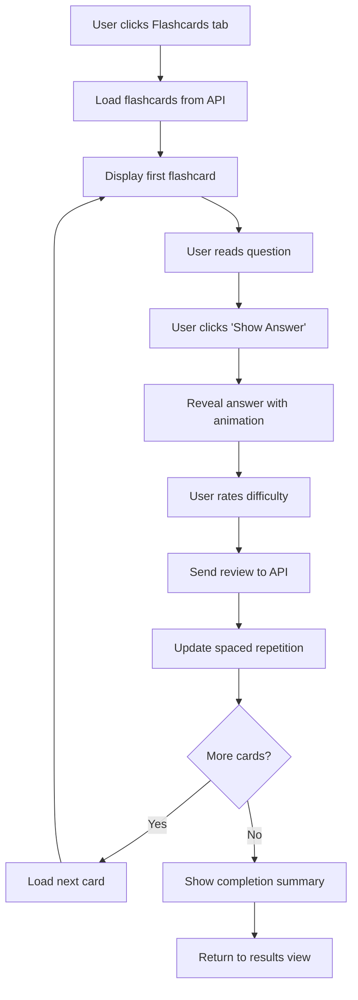
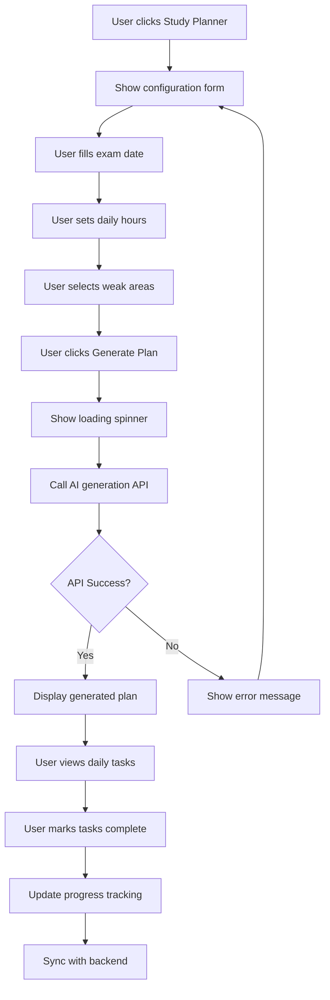
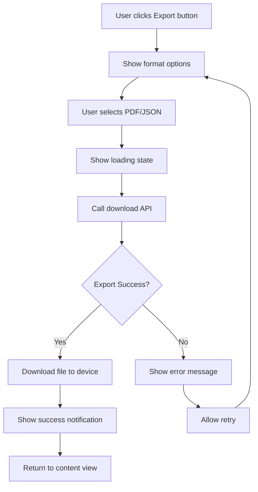

# StudyBuddy Frontend Documentation

## Architecture Overview

The StudyBuddy frontend is built using Next.js 14 with React 18, featuring a modern component-based architecture with three core new functionalities:

1. **Flashcard Review System** - Interactive flashcard interface with spaced repetition
2. **Study Planner Interface** - Visual study plan management and progress tracking
3. **Export Components** - Multi-format content export functionality

## Project Structure

```
frontend/
├── src/
│   ├── app/                      # Next.js App Router
│   │   ├── layout.tsx           # Root layout
│   │   ├── page.tsx             # Home page
│   │   ├── docs/                # API documentation page
│   │   ├── study-buddy/         # Main application
│   │   ├── study-planner/       # Study planner feature
│   │   ├── login/               # Authentication
│   │   └── register/            # User registration
│   │
│   ├── components/              # React Components
│   │   ├── ui/                  # Base UI components
│   │   ├── FileUpload.tsx       # File upload interface
│   │   ├── ResultsViewer.tsx    # Main results container
│   │   ├── StudyPlanForm.tsx    # Study plan configuration
│   │   ├── StudyPlannerViewer.tsx # Study plan display
│   │   ├── ExportButton.tsx     # Export functionality
│   │   ├── MockTestInterface.tsx # Interactive testing
│   │   └── Header.tsx           # Navigation header
│   │
│   ├── contexts/                # React Context
│   │   └── AuthContext.tsx      # Authentication state
│   │
│   ├── lib/                     # Utilities
│   │   ├── studybuddy-api.ts    # API client
│   │   └── utils.ts             # Helper functions
│   │
│   ├── types/                   # TypeScript definitions
│   │   └── api.ts               # API response types
│   │
│   └── styles/                  # Global styles
│       └── globals.css          # Tailwind CSS
```

## Core Features Implementation

### 1. Flashcard Review System

#### Component Structure
```typescript
// Flashcard display and interaction
interface FlashcardProps {
  flashcard: Flashcard;
  onReview: (difficulty: 'easy' | 'medium' | 'hard') => void;
  showAnswer: boolean;
  onToggleAnswer: () => void;
}

const FlashcardComponent: React.FC<FlashcardProps> = ({
  flashcard,
  onReview,
  showAnswer,
  onToggleAnswer
}) => {
  // Interactive flashcard with flip animation
  // Difficulty rating buttons
  // Progress tracking
};
```

#### Integration in ResultsViewer
```typescript
const ResultsViewer: React.FC = () => {
  const [flashcards, setFlashcards] = useState<Flashcard[]>([]);
  const [currentIndex, setCurrentIndex] = useState(0);
  
  const handleFlashcardReview = async (difficulty: string) => {
    // Call API to record review
    // Update spaced repetition schedule
    // Move to next flashcard
  };
  
  return (
    <div className="flashcard-container">
      {/* Flashcard display */}
      {/* Navigation controls */}
      {/* Progress indicators */}
    </div>
  );
};
```

### 2. Study Planner Interface

#### Study Plan Form Component
```typescript
interface StudyPlanFormProps {
  sessionId: string;
  onPlanGenerated: (plan: StudyPlan) => void;
}

const StudyPlanForm: React.FC<StudyPlanFormProps> = ({
  sessionId,
  onPlanGenerated
}) => {
  const [config, setConfig] = useState<StudyPlanConfig>({
    exam_date: '',
    daily_study_hours: 6,
    weak_areas: []
  });
  
  const handleSubmit = async () => {
    // Validate form data
    // Call study planner API
    // Handle loading states
    // Display generated plan
  };
  
  return (
    <form className="study-plan-form">
      {/* Date picker for exam date */}
      {/* Slider for daily study hours */}
      {/* Multi-select for weak areas */}
      {/* Submit button with loading state */}
    </form>
  );
};
```

#### Study Plan Viewer Component
```typescript
const StudyPlannerViewer: React.FC<{ plan: StudyPlan }> = ({ plan }) => {
  const [selectedDate, setSelectedDate] = useState<Date>(new Date());
  const [tasks, setTasks] = useState<StudyTask[]>([]);
  
  const updateTaskStatus = async (taskId: string, status: TaskStatus) => {
    // Call API to update task
    // Update local state
    // Recalculate progress
  };
  
  return (
    <div className="study-planner-viewer">
      {/* Calendar view */}
      {/* Daily task list */}
      {/* Progress charts */}
      {/* Task completion controls */}
    </div>
  );
};
```

### 3. Export Components

#### Export Button Component
```typescript
interface ExportButtonProps {
  contentType: 'questions' | 'flashcards' | 'notes' | 'study_plan';
  contentId: string;
  format?: 'pdf' | 'json';
  className?: string;
}

const ExportButton: React.FC<ExportButtonProps> = ({
  contentType,
  contentId,
  format = 'pdf',
  className
}) => {
  const [isExporting, setIsExporting] = useState(false);
  
  const handleExport = async () => {
    setIsExporting(true);
    try {
      // Call download API
      // Handle file download
      // Show success message
    } catch (error) {
      // Handle export errors
      // Show error message
    } finally {
      setIsExporting(false);
    }
  };
  
  return (
    <button
      onClick={handleExport}
      disabled={isExporting}
      className={`export-button ${className}`}
    >
      {isExporting ? 'Exporting...' : `Export ${format.toUpperCase()}`}
    </button>
  );
};
```

## State Management

### Authentication Context
```typescript
interface AuthContextType {
  user: User | null;
  login: (credentials: LoginCredentials) => Promise<void>;
  register: (userData: RegisterData) => Promise<void>;
  logout: () => void;
  isLoading: boolean;
}

const AuthContext = createContext<AuthContextType | undefined>(undefined);

export const AuthProvider: React.FC<{ children: ReactNode }> = ({ children }) => {
  const [user, setUser] = useState<User | null>(null);
  const [isLoading, setIsLoading] = useState(true);
  
  // Authentication logic
  // Token management
  // Auto-refresh handling
  
  return (
    <AuthContext.Provider value={{ user, login, register, logout, isLoading }}>
      {children}
    </AuthContext.Provider>
  );
};
```

### Session State Management
```typescript
// Custom hook for session management
const useSession = (sessionId: string) => {
  const [session, setSession] = useState<StudySession | null>(null);
  const [loading, setLoading] = useState(true);
  const [error, setError] = useState<string | null>(null);
  
  const refreshSession = useCallback(async () => {
    // Fetch session data
    // Update state
  }, [sessionId]);
  
  useEffect(() => {
    refreshSession();
  }, [refreshSession]);
  
  return { session, loading, error, refreshSession };
};
```

## API Integration

### API Client Configuration
```typescript
// lib/studybuddy-api.ts
class StudyBuddyAPI {
  private baseURL = process.env.NEXT_PUBLIC_API_URL || 'http://localhost:8000';
  private token: string | null = null;
  
  setAuthToken(token: string) {
    this.token = token;
  }
  
  private async request<T>(
    endpoint: string,
    options: RequestInit = {}
  ): Promise<T> {
    const url = `${this.baseURL}/api/v1${endpoint}`;
    const headers = {
      'Content-Type': 'application/json',
      ...(this.token && { Authorization: `Bearer ${this.token}` }),
      ...options.headers,
    };
    
    const response = await fetch(url, { ...options, headers });
    
    if (!response.ok) {
      throw new Error(`API Error: ${response.status}`);
    }
    
    return response.json();
  }
  
  // Flashcard methods
  async getFlashcards(sessionId: string, skip = 0, limit = 50) {
    return this.request<FlashcardListResponse>(
      `/flashcards/${sessionId}?skip=${skip}&limit=${limit}`
    );
  }
  
  async reviewFlashcard(flashcardId: string, review: FlashcardReview) {
    return this.request(`/flashcards/${flashcardId}/review`, {
      method: 'POST',
      body: JSON.stringify(review),
    });
  }
  
  // Study planner methods
  async generateStudyPlan(request: StudyPlanRequest) {
    return this.request<StudyPlanResponse>('/study-planner/generate-plan', {
      method: 'POST',
      body: JSON.stringify(request),
    });
  }
  
  async updateTaskStatus(taskId: string, status: TaskStatus) {
    return this.request(`/study-planner/tasks/${taskId}/status`, {
      method: 'PUT',
      body: JSON.stringify({ status }),
    });
  }
  
  // Export methods
  async downloadContent(contentType: string, contentId: string, format = 'pdf') {
    const response = await fetch(
      `${this.baseURL}/api/v1/download/${contentType}/${contentId}?format=${format}`,
      {
        headers: {
          ...(this.token && { Authorization: `Bearer ${this.token}` }),
        },
      }
    );
    
    if (!response.ok) {
      throw new Error(`Download failed: ${response.status}`);
    }
    
    return response.blob();
  }
}

export const api = new StudyBuddyAPI();
```

## Component Flow Diagrams

### Flashcard Review Flow


### Study Plan Generation Flow


### Export System Flow


## Styling & UI

### Design System
```css
/* globals.css - Design tokens */
:root {
  /* Colors */
  --primary-pink: #ec4899;
  --primary-fuchsia: #d946ef;
  --secondary-blue: #3b82f6;
  --success-green: #10b981;
  --warning-orange: #f59e0b;
  --error-red: #ef4444;
  
  /* Gradients */
  --gradient-primary: linear-gradient(135deg, var(--primary-pink), var(--primary-fuchsia));
  --gradient-secondary: linear-gradient(135deg, #667eea, #764ba2);
  
  /* Shadows */
  --shadow-sm: 0 1px 2px 0 rgb(0 0 0 / 0.05);
  --shadow-md: 0 4px 6px -1px rgb(0 0 0 / 0.1);
  --shadow-lg: 0 10px 15px -3px rgb(0 0 0 / 0.1);
  
  /* Border radius */
  --radius-sm: 0.375rem;
  --radius-md: 0.5rem;
  --radius-lg: 0.75rem;
  --radius-xl: 1rem;
}

/* Component classes */
.btn-primary {
  @apply bg-gradient-to-r from-pink-500 to-fuchsia-500 text-white px-6 py-3 rounded-xl font-semibold shadow-lg shadow-pink-200/50 hover:shadow-xl hover:shadow-pink-300/50 transition-all duration-300;
}

.btn-secondary {
  @apply bg-white text-gray-700 border border-gray-200 px-6 py-3 rounded-xl font-semibold hover:bg-gray-50 transition-all duration-300;
}

.glass-card {
  @apply bg-white/80 backdrop-blur-sm border border-pink-100 rounded-2xl shadow-lg shadow-pink-100/50;
}

.gradient-text {
  @apply bg-gradient-to-r from-pink-500 to-fuchsia-500 bg-clip-text text-transparent;
}
```

### Responsive Design
```typescript
// Responsive breakpoints
const breakpoints = {
  sm: '640px',
  md: '768px',
  lg: '1024px',
  xl: '1280px',
  '2xl': '1536px',
};

// Mobile-first approach
const ResponsiveComponent: React.FC = () => {
  return (
    <div className="
      grid grid-cols-1 gap-4
      md:grid-cols-2 md:gap-6
      lg:grid-cols-3 lg:gap-8
      xl:grid-cols-4
    ">
      {/* Responsive grid content */}
    </div>
  );
};
```

## Performance Optimization

### Code Splitting
```typescript
// Lazy loading for heavy components
const StudyPlannerViewer = lazy(() => import('./StudyPlannerViewer'));
const MockTestInterface = lazy(() => import('./MockTestInterface'));

// Usage with Suspense
<Suspense fallback={<LoadingSpinner />}>
  <StudyPlannerViewer plan={studyPlan} />
</Suspense>
```

### Memoization
```typescript
// Memoized components for performance
const FlashcardComponent = memo<FlashcardProps>(({ flashcard, onReview }) => {
  // Component implementation
});

// Memoized calculations
const studyProgress = useMemo(() => {
  return calculateProgress(tasks, completedTasks);
}, [tasks, completedTasks]);

// Memoized callbacks
const handleTaskUpdate = useCallback((taskId: string, status: TaskStatus) => {
  updateTaskStatus(taskId, status);
}, [updateTaskStatus]);
```

### Image Optimization
```typescript
import Image from 'next/image';

// Optimized images with Next.js
<Image
  src="/images/study-illustration.png"
  alt="Study illustration"
  width={400}
  height={300}
  priority={true}
  className="rounded-xl"
/>
```

## Error Handling

### Error Boundary
```typescript
class ErrorBoundary extends Component<
  { children: ReactNode },
  { hasError: boolean; error?: Error }
> {
  constructor(props: { children: ReactNode }) {
    super(props);
    this.state = { hasError: false };
  }
  
  static getDerivedStateFromError(error: Error) {
    return { hasError: true, error };
  }
  
  componentDidCatch(error: Error, errorInfo: ErrorInfo) {
    console.error('Error caught by boundary:', error, errorInfo);
    // Log to error reporting service
  }
  
  render() {
    if (this.state.hasError) {
      return (
        <div className="error-fallback">
          <h2>Something went wrong</h2>
          <button onClick={() => this.setState({ hasError: false })}>
            Try again
          </button>
        </div>
      );
    }
    
    return this.props.children;
  }
}
```

### API Error Handling
```typescript
const useApiCall = <T>(apiCall: () => Promise<T>) => {
  const [data, setData] = useState<T | null>(null);
  const [loading, setLoading] = useState(false);
  const [error, setError] = useState<string | null>(null);
  
  const execute = useCallback(async () => {
    setLoading(true);
    setError(null);
    
    try {
      const result = await apiCall();
      setData(result);
    } catch (err) {
      setError(err instanceof Error ? err.message : 'An error occurred');
    } finally {
      setLoading(false);
    }
  }, [apiCall]);
  
  return { data, loading, error, execute };
};
```

## Testing

### Component Testing
```typescript
// __tests__/components/ExportButton.test.tsx
import { render, screen, fireEvent, waitFor } from '@testing-library/react';
import { ExportButton } from '../ExportButton';

describe('ExportButton', () => {
  it('should handle export successfully', async () => {
    const mockDownload = jest.fn().mockResolvedValue(new Blob());
    
    render(
      <ExportButton
        contentType="questions"
        contentId="test-id"
        format="pdf"
      />
    );
    
    const button = screen.getByRole('button', { name: /export pdf/i });
    fireEvent.click(button);
    
    await waitFor(() => {
      expect(button).toHaveTextContent('Exporting...');
    });
    
    await waitFor(() => {
      expect(button).toHaveTextContent('Export PDF');
    });
  });
});
```

### Integration Testing
```typescript
// __tests__/integration/StudyPlanner.test.tsx
import { render, screen, fireEvent, waitFor } from '@testing-library/react';
import { StudyPlannerPage } from '../app/study-planner/page';

describe('Study Planner Integration', () => {
  it('should generate and display study plan', async () => {
    render(<StudyPlannerPage />);
    
    // Fill form
    fireEvent.change(screen.getByLabelText(/exam date/i), {
      target: { value: '2026-02-15' }
    });
    
    fireEvent.change(screen.getByLabelText(/daily hours/i), {
      target: { value: '6' }
    });
    
    // Submit form
    fireEvent.click(screen.getByRole('button', { name: /generate plan/i }));
    
    // Wait for plan to be generated
    await waitFor(() => {
      expect(screen.getByText(/study plan generated/i)).toBeInTheDocument();
    });
  });
});
```

## Deployment

### Build Configuration
```javascript
// next.config.js
/** @type {import('next').NextConfig} */
const nextConfig = {
  output: 'standalone',
  images: {
    domains: ['localhost', 'api.studybuddy.com'],
  },
  env: {
    NEXT_PUBLIC_API_URL: process.env.NEXT_PUBLIC_API_URL,
  },
  async rewrites() {
    return [
      {
        source: '/api/:path*',
        destination: `${process.env.NEXT_PUBLIC_API_URL}/api/:path*`,
      },
    ];
  },
};

module.exports = nextConfig;
```

### Docker Configuration
```dockerfile
FROM node:18-alpine AS base

# Install dependencies
FROM base AS deps
WORKDIR /app
COPY package.json package-lock.json ./
RUN npm ci

# Build application
FROM base AS builder
WORKDIR /app
COPY --from=deps /app/node_modules ./node_modules
COPY . .
RUN npm run build

# Production image
FROM base AS runner
WORKDIR /app
ENV NODE_ENV production

RUN addgroup --system --gid 1001 nodejs
RUN adduser --system --uid 1001 nextjs

COPY --from=builder /app/public ./public
COPY --from=builder --chown=nextjs:nodejs /app/.next/standalone ./
COPY --from=builder --chown=nextjs:nodejs /app/.next/static ./.next/static

USER nextjs
EXPOSE 3000
ENV PORT 3000

CMD ["node", "server.js"]
```

## Environment Configuration

### Development
```bash
# .env.local
NEXT_PUBLIC_API_URL=http://localhost:8000
NEXT_PUBLIC_APP_NAME=StudyBuddy
NEXT_PUBLIC_ENVIRONMENT=development
```

### Production
```bash
# .env.production
NEXT_PUBLIC_API_URL=https://api.studybuddy.com
NEXT_PUBLIC_APP_NAME=StudyBuddy
NEXT_PUBLIC_ENVIRONMENT=production
NEXT_PUBLIC_ANALYTICS_ID=your-analytics-id
```
