# Study Buddy App - System Architecture Documentation

## 🏗️ Complete System Architecture

This document provides comprehensive system architecture documentation for the Study Buddy App, including all system diagrams, component interactions, and architectural decisions.

---

## 📊 High-Level System Architecture

## 🔄 Application Flow Architecture

```mermaid
flowchart TD
    Start([User Opens App]) --> Auth{Authenticated?}
    
    Auth -->|No| Login[Login/Register Page]
    Login --> OTP[Enter Mobile & OTP]
    OTP --> Dashboard[Study Buddy Dashboard]
    
    Auth -->|Yes| Dashboard
    
    Dashboard --> Choice{Input Method}
    
    Choice -->|Files| Upload[File Upload Interface]
    Choice -->|Text| TextInput[Text Input Form]
    
    Upload --> FileValidation{Valid Files?}
    FileValidation -->|No| UploadError[Show Error Message]
    UploadError --> Upload
    FileValidation -->|Yes| ProcessFiles[Process Files]
    
    TextInput --> ProcessText[Process Text Input]
    
    ProcessFiles --> Extract[Text Extraction]
    ProcessText --> Extract
    
    Extract --> AIProcess[AI Content Generation]
    
    AIProcess --> Generate[Generate 5 Content Types]
    
    Generate --> Questions[📝 Questions]
    Generate --> MockTests[🎯 Mock Tests]
    Generate --> Mnemonics[🧠 Mnemonics]
    Generate --> CheatSheets[📋 Cheat Sheets]
    Generate --> Notes[📚 Notes]
    Generate --> Flashcards[🃏 Flashcards]
    
    Questions --> Results[Results Viewer]
    MockTests --> Results
    Mnemonics --> Results
    CheatSheets --> Results
    Notes --> Results
    Flashcards --> FlashcardReview[Flashcard Review System]
    
    Results --> Actions{User Action}
    Actions -->|Take Test| TestInterface[Mock Test Interface]
    Actions -->|Study Plan| StudyPlanner[Study Planner]
    Actions -->|Download| Export[Export Content]
    Actions -->|New Session| Dashboard
    Actions -->|View History| History[Session History]
    
    FlashcardReview --> SpacedRepetition[Spaced Repetition Algorithm]
    SpacedRepetition --> Results
    
    StudyPlanner --> PlanGeneration[AI Plan Generation]
    PlanGeneration --> DailySchedule[Daily Study Schedule]
    DailySchedule --> ProgressTracking[Progress Tracking]
    ProgressTracking --> Results
    
    TestInterface --> TestResults[Test Results & Analytics]
    TestResults --> Results
    
    History --> SessionDetails[Session Details]
    SessionDetails --> Results
    
    Export --> Download[Download Files]
    Download --> Results
```

## 🏛️ Technical Architecture

## 🔐 Authentication Flow

## 📁 Processing Pipeline Architecture

## 🎨 User Interface Flow

## 🚀 Feature Overview Architecture

## 📊 Data Flow Architecture

## 🔄 Content Generation Workflow

## 🃏 Flashcard System Flow

## 📅 Study Planner Flow

## 📥 Export System Flow

---

## 🏗️ Architectural Decisions

### Technology Stack Rationale

| Component | Technology | Rationale |
|-----------|------------|-----------|
| **Frontend** | Next.js 14 + React 18 | Modern React patterns, server components, excellent TypeScript support |
| **Backend** | FastAPI + Python 3.12 | High performance async API, automatic OpenAPI docs, excellent for AI integration |
| **Database** | MongoDB | Flexible schema for varied medical content types, excellent for session-based data |
| **AI Service** | Google Gemini API | Cost-effective, excellent medical content generation, good JSON response handling |
| **Authentication** | JWT + Mobile OTP | Secure, stateless, perfect for Indian medical student market |
| **Styling** | TailwindCSS | Utility-first, responsive design, excellent for medical education UI |

### Scalability Considerations

- **Horizontal Scaling**: Stateless API design allows multiple backend instances
- **Database Optimization**: Proper indexing and connection pooling for medical content queries
- **Caching Strategy**: Redis for session data and frequently accessed medical content
- **File Storage**: Configurable local/S3 storage for medical documents
- **AI Service**: Rate limiting and retry mechanisms for reliable medical content generation

### Security Architecture

- **Authentication**: JWT tokens with mobile OTP verification
- **Authorization**: User-specific data isolation for medical study sessions
- **Data Protection**: Encrypted sensitive data, secure environment variables
- **API Security**: Rate limiting, input validation, CORS configuration
- **File Security**: Upload validation, size limits, secure file storage

---

## 📈 Performance Optimization

### Backend Optimizations
- **Async Processing**: All I/O operations use async/await patterns
- **Database Indexing**: Optimized queries for medical content retrieval
- **Connection Pooling**: Efficient database connection management
- **Caching**: Redis caching for frequently accessed medical data

### Frontend Optimizations
- **Code Splitting**: Dynamic imports for medical education components
- **Image Optimization**: Next.js automatic image optimization
- **Bundle Optimization**: Tree shaking and minification
- **Lazy Loading**: Components loaded on demand for better performance

### AI Service Optimizations
- **Request Batching**: Multiple content types generated in single AI call
- **Response Caching**: Cache similar medical content requests
- **Error Handling**: Robust retry mechanisms for AI service reliability
- **Rate Limiting**: Respect AI service limits while maintaining performance

---

*This architecture documentation provides complete system understanding for developers, administrators, and medical education professionals working with the Study Buddy App.*
